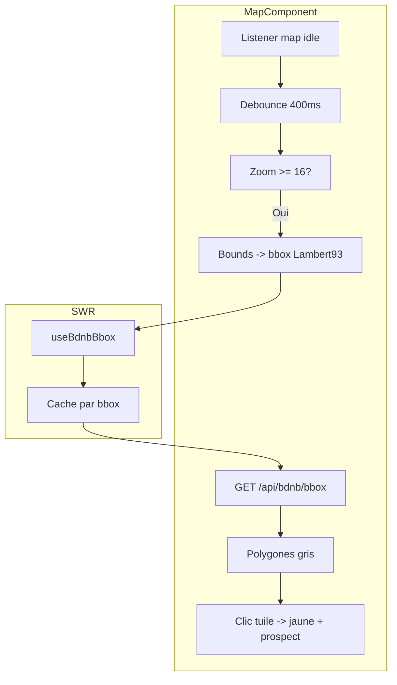

# Design : Tuiles BDNB sur la carte

**Date :** 2025-03-07  
**Statut :** Validé

## Objectif

Afficher les bâtiments BDNB sous forme de tuiles grises discrètes sur la vue satellite, à chaque déplacement/zoom de la carte. Les POI Google restent au-dessus. Clic sur une tuile → sélection (jaune) et chargement du prospect.

## Contraintes

- API BDNB gratuite : 120 req/min, 10 000 req/mois
- Cache SWR + debounce 400 ms pour limiter les appels
- Affichage uniquement à partir du zoom 16

## Architecture

## Composants modifiés

| Composant | Modification |
|-----------|--------------|
| API | Route `GET /api/bdnb/bbox` ou paramètres bbox sur route existante |
| lib/swr-hooks.ts | Hook `useBdnbBbox(bounds)` |
| MapComponent | Listener idle, debounce, rendu polygones, clic |

## Spécifications

- **Style tuiles grises :** fillColor `#9ca3af`, fillOpacity `0.25`, strokeColor `#6b7280`, zIndex `0`
- **Tuile sélectionnée :** jaune (style existant prospect)
- **Zoom seuil :** 16
- **Debounce :** 400 ms
- **Cache SWR :** 1 h, dedupingInterval 5 min
