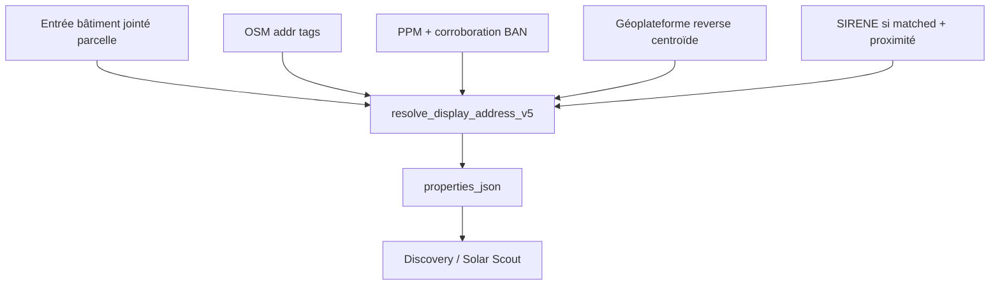

# Résolution d’adresse matching V5 — cascade conservatrice (approche 1)

## Contexte

- L’adresse parcelle (`passerelle_address`, PPM) est souvent **vide** ou **non pertinente** (propriétaire, siège, vote majoritaire sur plusieurs SIREN).
- En **zone industrielle**, l’adresse cadastrale est rarement celle de l’entrée du bâtiment ciblé.
- Objectif validé : **adresse postale proche du bâtiment**, **sans faux positif** — préférer l’absence d’adresse à une adresse fausse affichée comme certaine.

## Décision

**Approche 1** : cascade conservatrice **dans le pipeline** `run_matching_v5.py`, **sans nouvelle table** Postgres. Enrichissement stocké dans `properties_json` des features exportées.

**Hors périmètre v1**

- Table dédiée `scout_building_resolved_address` (approche 2).
- File de relecture manuelle (approche 3).
- Google Places comme `display_address` (reste pour POI / fallback SIRENE existant).
- Géocodage à la volée côté Next.js (trop lent, non rejouable).

## Architecture

**Grain** : priorité **bâtiment** (`buildings_json` / ligne `grain=building`) ; pour `grain=parcelle` sans bâtiment sélectionné, repli sur centroïde parcelle avec seuils **plus stricts**.

## Cascade (ordre strict)

| Étape | Source | Condition d’acceptation (`display_address_confidence = confirmed`) |
|-------|--------|---------------------------------------------------------------------|
| 1 | OSM `addr:*` (`osm_address_text`) | `addr:full` **ou** (`addr:street` + `addr:housenumber`) présents sur le footprint |
| 2 | PPM `passerelle_address` | Numéro exploitable (`passerelle_numero_match_set` non vide) **et** corroboration géocodage inverse au centroïde bâtiment (voir ci-dessous) |
| 2b | PPM `passerelle_address` (match SIRENE) | `status_technique = matched` : conserver l’adresse passerelle qui a permis le match (sans remplacer par BAN reverse ni `adresse_etablissement` SIRENE) |
| 3 | Géocodage inverse Géoplateforme | 1 requête au centroïde bâtiment ; voir seuils (si pas de match SIRENE) |

Si aucune étape ne passe : `display_address` vide, `display_address_confidence = none`, libellé UI inchangé côté cadastre (« Adresse non renseignée » / section-numéro).

### Corroboration PPM (étape 2)

1. Géocodage inverse au centroïde bâtiment (même appel que étape 3, **mis en cache** par coordonnées arrondies).
2. Accepter PPM si :
   - `commune` / `code_insee` cohérent avec le résultat BAN ;
   - voie normalisée : exacte ou WRatio ≥ 90 ;
   - numéro : appartient à `street_number_match_set` du PPM **ou** ensemble vide côté BAN avec distance ≤ 80 m ;
3. Sinon : **rejeter** PPM pour `display_address` (la passerelle reste utilisable pour le matching SIRENE existant).

### Seuils géocodage inverse (étape 3)

Service : **Géoplateforme** (remplace `api-adresse.data.gouv.fr`, déprécié fin 2026). URL à centraliser dans un module `geoplateforme_geocode.py`.

| Contexte | `score` min | Distance max (m) centroïde → point BAN |
|----------|-------------|------------------------------------------|
| Standard | 0,85 | 25 |
| Zone pro (`zone_source=landuse` et `zone_tag` ∈ commercial, industrial, retail) | 0,88 | 20 |

Refus explicite si : hors commune (`code_insee`), type résultat non `housenumber`/`street`, ou `score` absent.

### Match SIRENE (étape 2b)

Si le matching établissement a réussi (`status_technique = matched`), `display_address` = **`passerelle_address`** (source `ppm`). Pas de géocodage direct de `adresse_etablissement` en affichage (évite de remplacer l’ancre du match).

## Champs exportés

Ajouts dans `properties_json` (et colonnes dérivées si déjà mappées côté parse TS) :

| Champ | Description |
|-------|-------------|
| `display_address` | Libellé une ligne affichable |
| `display_address_source` | `osm` \| `ppm` \| `ban_reverse` \| `sirene` \| `none` |
| `display_address_confidence` | `confirmed` \| `none` (v1 : pas de `probable` affiché) |
| `display_address_meta_json` | Audit : `distance_m`, `ban_score`, `corroboration`, `reject_reason` |

**Non modifié pour le matching SIRENE** : `passerelle_address`, logique `match_etablissements_for_parcel`, fallback OSM synthétique Google.

## Intégration pipeline

1. Nouveau module `data-pipeline/matching_v5/address_resolver_v5.py` (fonctions pures + client HTTP Géoplateforme injectable pour tests).
2. Appel depuis `run_matching_v5.py` lors de la construction de `buildings_json` / export parcelle et building.
3. Cache en mémoire par run : clé `(round(lon,5), round(lat,5))` pour limiter les appels.
4. Rate limit : ≤ 40 req/s, backoff sur HTTP 429.
5. Flag CLI `--no-address-resolve` pour runs offline / tests sans réseau.

## Côté application

| Fichier | Changement |
|---------|------------|
| `lib/scout-matching-v5-map.ts` | Parser `display_address*` ; `formatDiscoveryDrawerHeroAddress` : priorité `display_address` confirmé avant Google/OSM POI/PPM |
| `lib/matching-v5-to-prospect.ts` | `primaryAddress()` lit `display_address` en premier |
| `docs/MATCHING-V5.md` | Section adresse + cascade |

Ordre d’affichage Discovery proposé :

1. `display_address` (confirmed)
2. Google anchor (inchangé si pas de display)
3. OSM POI
4. PPM / cadastre

## Gestion d’erreurs

| Cas | Comportement |
|-----|----------------|
| API indisponible / 429 persistant | Pas de `display_address` ; log warning ; run continue |
| Pas de géométrie bâtiment | Repli parcelle (seuils +5 m distance, +0,02 score) ou `none` |
| OSM addr partiel (rue sans numéro) | **Ne pas** accepter en étape 1 ; tenter étapes suivantes |

## Tests

- `data-pipeline/python/tests/test_address_resolver_v5.py` : matrice de cas (OSM ok, PPM rejeté, BAN ok/ko, ZI seuils, SIRENE proximité, tout vide).
- `lib/scout-matching-v5-map.test.ts` : priorité `display_address` dans `formatDiscoveryDrawerHeroAddress`.
- `lib/matching-v5-to-prospect.test.ts` : `primaryAddress` avec `display_address`.

## Déploiement

Re-lancer le matching par commune : `npm run pipeline:matching-v5:run` avec `--write-postgres` après implémentation.

## Risques acceptés

- **Couverture** plus faible que l’approche 2 batch (choix assumé anti-faux positifs).
- **Coût API** lors du run matching (mitigé par cache + rate limit).
- Migration **Géoplateforme** obligatoire avant fin 2026.
