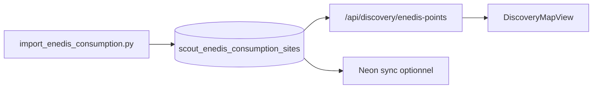

# Couche consommation Enedis — Discovery

## Objectif

Afficher sur la carte Discovery une **couche indépendante** de points consommation électrique entreprise (open data Enedis), activable via le panneau filtres avec slider **MWh/an** et sélecteur d’**année**.

## Architecture v2 (base de données)

| Composant | Rôle |
|-----------|------|
| `scout_enedis_consumption_sites` | Table Postgres (Point 4326, statut géocodage) |
| `import_enedis_consumption.py` | Import par `--dep` / `--code-insee` depuis API ODS + géocodage Géoplateforme |
| `/api/discovery/enedis-points` | Requête SQL `ST_Intersects` + filtres MWh / année |
| UI Discovery | Inchangée (switch, slider, marqueurs ⚡) |



## Pipeline

```bash
npm run pipeline:enedis:schema
npm run pipeline:enedis:import-dep-33   # dep 33, 2024, géocodage
npm run pipeline:enedis:geocode-failed  # reprise adresses échouées
npm run pipeline:enedis:sync-neon-dep-33
```

## Contraintes données

- Dataset : [Consommation annuelle entreprise par adresse](https://opendata.enedis.fr/datasets/consommation-annuelle-entreprise-par-adresse)
- Pas de coordonnées dans l’API source → géocodage à l’**import** (pas au runtime)
- Données indicatives (fiabilité adresse non garantie)

## Décisions

| Sujet | Choix |
|-------|--------|
| Modèle carte | Points ⚡ indépendants des combos scout |
| Périmètre import | Départements Scout (33, 31, …) |
| Année | Sélecteur 2018–2024 |
| Runtime | **SQL uniquement** (plus d’appel Enedis/Géoplateforme depuis Next.js) |

## Tables

- **Active** : `017_scout_enedis_consumption_sites.sql`
- **Obsolète** : `016_scout_enedis_geocode_cache` (remplacée par colonnes géocode dans 017)

## Hors périmètre

- Lien Enedis ↔ bâtiment scout
- Drawer au clic
- Import national hors deps Scout
